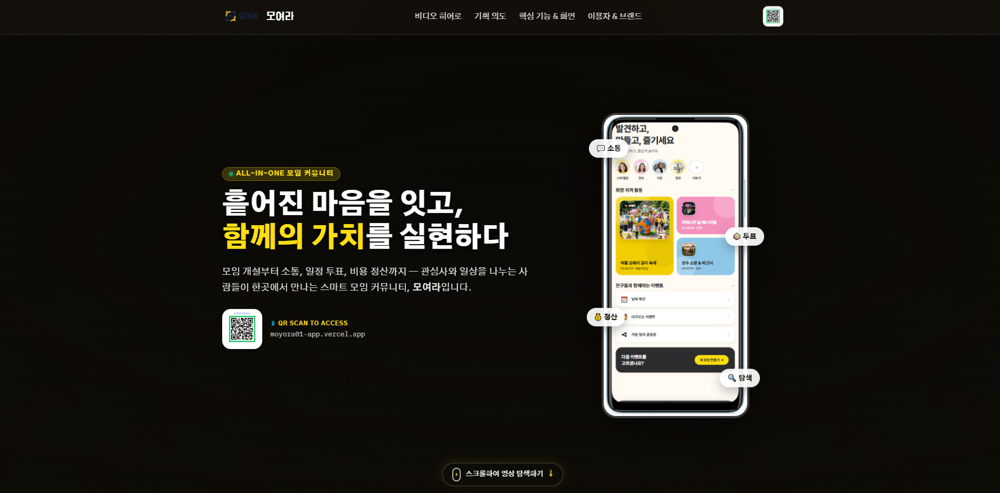
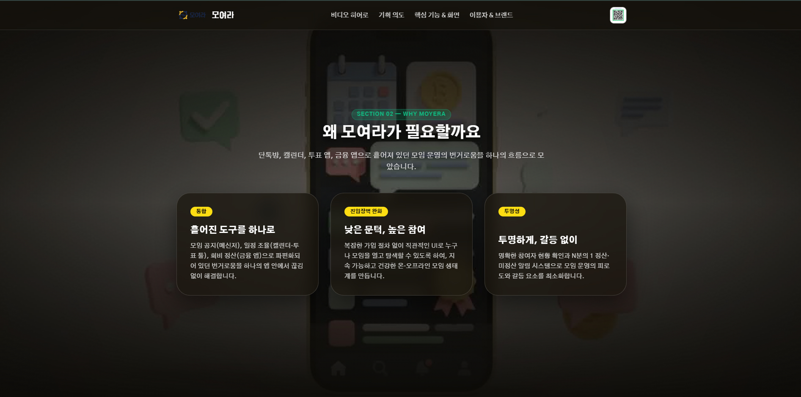
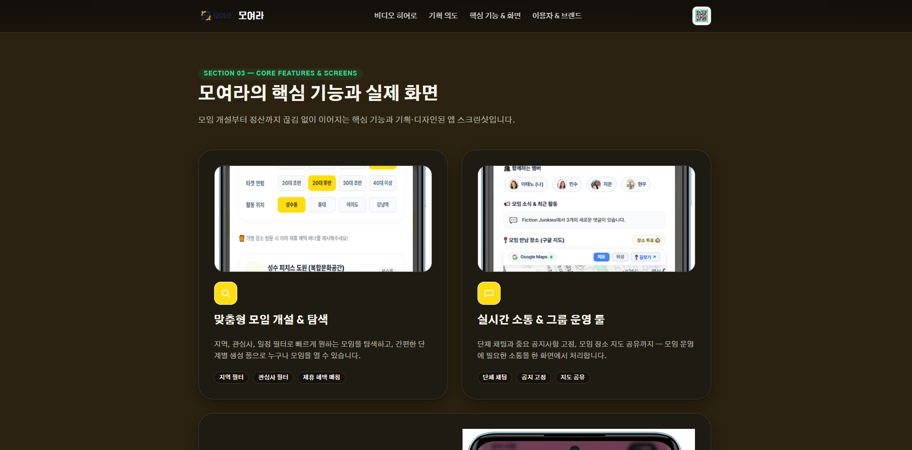
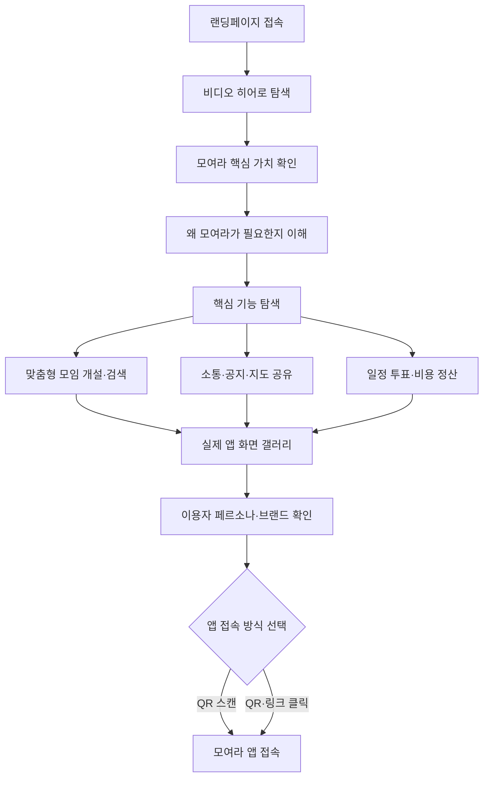
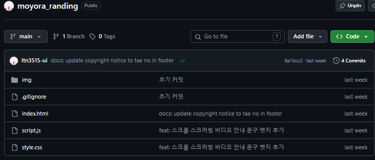

# 🟡 모여라 Landing Page — 스마트 모임 커뮤니티 소개 페이지

> 모임 개설부터 소통, 일정 투표, 장소 공유와 비용 정산까지 이어지는 모여라 앱의 가치와 주요 기능을 스크롤 인터랙션으로 소개하는 랜딩페이지

<p>
  
  
  
  
  
  
</p>

## 🔗 프로젝트 링크

| 구분 | 링크 |
|---|---|
| 🌐 랜딩페이지 | [ltn3515-ui.github.io/moyora_randing](https://ltn3515-ui.github.io/moyora_randing) |
| 📦 Deployments | [GitHub Deployments](https://github.com/ltn3515-ui/moyora_randing/deployments) |
| 💻 GitHub | [ltn3515-ui/moyora_randing](https://github.com/ltn3515-ui/moyora_randing) |

## 🖼️ 주요 화면

<table>
  <tr>
    <th>비디오 히어로</th>
    <th>기획 의도</th>
    <th>핵심 기능 & 실제 화면</th>
  </tr>
  <tr>
    <td></td>
    <td></td>
    <td></td>
  </tr>
</table>

## 💡 프로젝트 개요

모임을 운영할 때 사용자는 메신저, 캘린더, 투표 앱, 지도와 금융 앱을 번갈아 사용해야 합니다. 이 과정에서 일정과 장소가 흩어지고, 참여 여부나 비용 정산 내역이 누락되기 쉽습니다.

모여라 랜딩페이지는 이러한 문제를 `Problem → Solve → Result` 흐름으로 설명하고, 실제 앱 화면과 인터랙션을 통해 모여라의 핵심 가치를 빠르게 이해하도록 제작했습니다.

### 핵심 문제

- 모임 공지, 일정 조율, 장소 결정과 비용 정산 도구가 분산되어 있습니다.
- 복잡한 가입 절차와 익숙하지 않은 UI는 모임 참여의 진입 장벽이 됩니다.
- 구두 정산과 N분의 1 계산은 누락과 갈등을 만들 수 있습니다.
- 기능을 글로만 설명하면 실제 앱의 사용 경험을 전달하기 어렵습니다.

### 해결 방향

`브랜드 메시지 확인 → 문제 공감 → 핵심 기능 탐색 → 실제 앱 화면 확인 → QR 또는 링크로 앱 접속`의 흐름으로 랜딩페이지를 구성했습니다.

## ✨ 주요 기능 & 인터랙션

### 1. 200프레임 비디오 히어로

첫 화면에서 스크롤 위치를 200장의 이미지 프레임과 연결해 영상처럼 재생되는 Canvas 스크러빙 효과를 구현했습니다. 사용자가 직접 스크롤 속도를 조절하며 브랜드 메시지와 앱 화면을 탐색할 수 있습니다.

### 2. 기획 의도 스크롤 스토리텔링

두 번째 구간에서도 200프레임 이미지 시퀀스를 사용하고, 진행률에 따라 제목과 문제 해결 카드가 등장하도록 구성했습니다. 흩어진 도구의 통합, 낮은 진입 장벽과 투명한 정산이라는 핵심 가치를 단계적으로 전달합니다.

### 3. 모여라 핵심 기능 소개

- 지역·관심사·일정 조건을 활용한 맞춤형 모임 탐색
- 모임 개설과 초대 링크 공유
- 단체 소통, 공지 고정과 장소 지도 공유
- 일정·장소 투표와 참여자 의견 수집
- 영수증 기반 비용 분배와 N차 정산 경험

랜딩페이지에서는 실제 앱 화면을 기능별 카드와 갤러리로 연결해 서비스 사용 장면을 구체적으로 보여줍니다.

### 4. 실제 화면 갤러리와 라이트박스

모바일 앱 화면을 가로형 필름 스트립으로 구성하고, 이미지를 선택하면 큰 화면으로 확인할 수 있는 라이트박스를 제공합니다. 마우스, 키보드 Enter·Space와 ESC 닫기를 지원합니다.

### 5. QR 기반 앱 연결

상단 내비게이션, 히어로와 하단 CTA에 QR 코드를 배치했습니다. 데스크톱에서는 스마트폰으로 스캔하고, QR 이미지를 클릭하면 모여라 앱 페이지로 바로 이동할 수 있습니다.

### 6. 반응형 내비게이션

데스크톱에서는 섹션 링크를 가로로 제공하고, 모바일에서는 메뉴 버튼으로 전환합니다. 기능 카드와 사용자 페르소나 영역도 화면 너비에 따라 2열에서 1열로 재배치됩니다.

### 7. 브랜드·페르소나 소개

서비스의 주요 사용자를 페르소나 카드로 설명하고, 로고·컬러·타이포그래피 등 디자인 시스템을 함께 보여줍니다. 앱의 사용성과 브랜드 정체성을 하나의 랜딩페이지에서 전달합니다.

## 🧭 사용자 플로우



## 🗂️ 폴더 구조

```text
moyora_randing/
├── img/
│   ├── moyora01_frame/              # 히어로 스크롤 시퀀스 200프레임
│   │   └── ezgif-...-jpg/
│   │       ├── ezgif-frame-001.jpg
│   │       ├── ...
│   │       └── ezgif-frame-200.jpg
│   ├── moyora02_frame/              # 기획 의도 스크롤 시퀀스 200프레임
│   │   └── ezgif-...-jpg/
│   │       ├── ezgif-frame-001.jpg
│   │       ├── ...
│   │       └── ezgif-frame-200.jpg
│   ├── moyora03_frame/              # 추가 영상 프레임 리소스
│   ├── moyora01.mp4                 # 모여라 소개 영상 원본 01
│   ├── moyora02.mp4                 # 모여라 소개 영상 원본 02
│   ├── moyora03.mp4                 # 모여라 소개 영상 원본 03
│   ├── Redmi Note 11 Pro-*.jpg      # 모여라 모바일 앱 화면 이미지
│   ├── 회원가입목업.jpg             # 회원가입 화면 목업
│   ├── moyora.jpg                   # 앱 접속 QR 이미지
│   └── logo.png                     # 모여라 로고
├── index.html                       # 랜딩페이지 콘텐츠·카드·갤러리 구조
├── style.css                        # 브랜드 디자인·반응형·스크롤 화면 스타일
├── script.js                        # Canvas 스크러빙·리빌·메뉴·라이트박스
└── .gitignore                       # Git 추적 제외 설정
```

<details>
  <summary><strong>GitHub 저장소 구조 캡처 보기</strong></summary>
  <br />
  
</details>

## 🛠️ 기술 스택

| 구분 | 기술 | 활용 내용 |
|---|---|---|
| Markup | HTML5 | 시맨틱 섹션·기능 카드·갤러리·라이트박스 구조 |
| Styling | CSS3 | 브랜드 컬러·반응형 그리드·고정형 스크롤 섹션 |
| Interaction | JavaScript | 메뉴·화면 확대·키보드 조작·스크롤 상태 제어 |
| Rendering | Canvas API | 이미지 시퀀스 프레임 렌더링과 화면 비율 보정 |
| Performance | requestAnimationFrame | 스크롤 이벤트 렌더링 최적화 |
| Observation | IntersectionObserver | 콘텐츠 스크롤 리빌 애니메이션 |
| Deploy | GitHub Pages | 정적 랜딩페이지 배포 |

## 🤖 AI 활용 프로세스

AI는 결과를 대신 만드는 도구가 아니라 기획과 코드의 초안을 빠르게 만들고, 사람이 실제 화면에서 검증·수정하는 협업 도구로 활용했습니다.

### ① 리서치·기획 — 문제와 가치 제안 정리

모임 운영 과정에서 여러 앱을 오가야 하는 불편을 분석하고, 모여라의 가치 제안을 `통합`, `진입 장벽 완화`, `투명성`의 세 축으로 정리하는 데 AI를 활용했습니다. 이후 실제 서비스 기능과 맞지 않는 표현은 직접 삭제하거나 수정했습니다.

### ② 정보 구조 — 랜딩페이지 이야기 흐름 설계

사용자가 짧은 시간 안에 서비스를 이해하도록 `히어로 → 문제 인식 → 해결 기능 → 실제 화면 → 사용자·브랜드 → 앱 접속` 순서의 초안을 AI와 함께 구성했습니다. 최종 섹션 우선순위와 문구는 화면 길이와 가독성을 기준으로 직접 조정했습니다.

### ③ 콘텐츠 — 기능 설명과 카피라이팅

모임 개설, 소통, 투표와 정산 기능을 짧고 일관된 문장으로 설명하는 데 AI를 활용했습니다. 메인 카피인 “흩어진 마음을 잇고, 함께의 가치를 실현하다”를 중심으로 각 섹션의 메시지를 통일했습니다.

### ④ 개발 — Canvas 스크롤 코드 초안

스크롤 진행률을 이미지 번호로 변환하고 Canvas에 200프레임을 그리는 코드 구조, 콘텐츠 리빌과 라이트박스 인터랙션의 초안을 AI 바이브코딩으로 제작했습니다.

> “스크롤 비율에 따라 200장의 이미지 프레임을 Canvas에 렌더링하고, 화면 비율을 유지하는 인터랙션을 구현해줘.”

이미지 로딩 순서, 고해상도 화면의 픽셀 비율, 모바일 레이아웃과 이벤트 중복 문제는 실제 브라우저에서 확인하며 직접 수정했습니다.

### ⑤ 검증·개선 — 반응형과 사용성 점검

AI 체크리스트를 활용해 모바일 내비게이션, 키보드 조작, 이미지 대체 텍스트와 화면 크기별 카드 배치를 점검했습니다. 최종 결과는 데스크톱과 모바일 환경에서 반복 테스트했습니다.

## 🩹 트러블슈팅

| 이슈 | 원인 | 해결 |
|---|---|---|
| 첫 접속 시 스크롤 영상이 늦게 표시됨 | 200프레임 이미지 동시 로드 | 이미지 프리로드 후 첫 프레임부터 우선 렌더링 |
| Canvas 이미지가 화면마다 잘림 | 원본과 브라우저 화면 비율 차이 | cover 방식의 크기·중앙 좌표 계산 적용 |
| 빠른 스크롤에서 화면이 끊김 | 스크롤 이벤트마다 즉시 다시 그리기 | `requestAnimationFrame`으로 렌더 호출 제한 |
| 모바일에서 기능 카드가 좁게 표시됨 | 데스크톱 2열 그리드 유지 | 900px 이하에서 카드·페르소나 영역을 1열로 변경 |
| 확대 이미지가 키보드로 닫히지 않음 | 마우스 클릭만 이벤트 처리 | Enter·Space 열기와 ESC 닫기 이벤트 추가 |

## 🚀 로컬 실행 방법

이 프로젝트는 HTML·CSS·JavaScript로 제작한 정적 웹사이트이므로 별도의 패키지 설치 없이 실행할 수 있습니다. 이미지 프레임 경로를 안정적으로 불러오려면 로컬 서버 사용을 권장합니다.

```bash
# 저장소 복제
git clone https://github.com/ltn3515-ui/moyora_randing.git

# 프로젝트 폴더 이동
cd moyora_randing

# VS Code Live Server 또는 간단한 로컬 서버 실행
python -m http.server 5500
```

브라우저에서 `http://localhost:5500`으로 접속합니다.

## 📌 향후 개선 계획

- 대용량 JPG 프레임의 WebP·AVIF 변환과 지연 로딩
- 저사양 모바일 기기를 위한 영상 또는 정적 이미지 대체 모드
- 실제 모여라 앱의 회원가입·모임 생성 화면과 딥링크 연결
- 랜딩페이지 CTA 클릭과 QR 유입 분석
- Open Graph·구조화 데이터 등 검색 및 공유 최적화
- 사용자 테스트 결과를 반영한 카피와 섹션 순서 개선

## 👤 담당 업무

- 모여라 서비스 문제 정의와 랜딩페이지 기획
- 사용자 플로우와 정보 구조 설계
- 브랜드 카피·UI 디자인·반응형 화면 구성
- HTML·CSS·JavaScript 퍼블리싱
- Canvas 기반 200프레임 스크롤 인터랙션 구현
- 갤러리·라이트박스·QR 앱 연결 기능 제작
- AI 바이브코딩을 활용한 코드 생성·검증·반복 개선
- GitHub 형상관리와 GitHub Pages 배포

## 📄 라이선스

본 프로젝트는 포트폴리오 및 학습 목적으로 제작한 모여라 서비스 랜딩페이지입니다.
